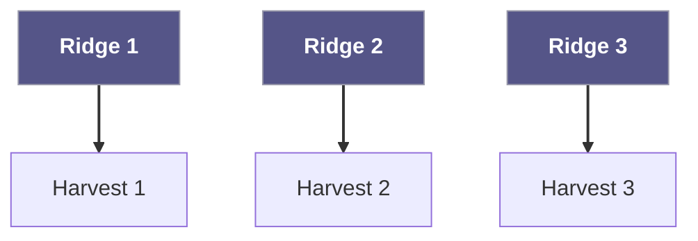
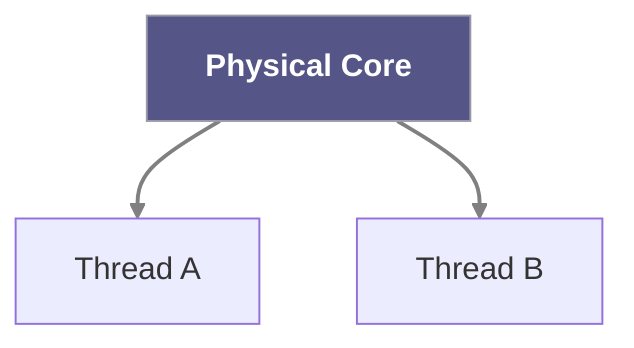
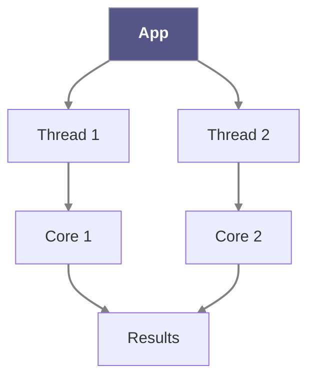

---
# Theme configuration
theme: seriph
# Presentation metadata
title: CPU Cores, Threads & GPUs
info: |
  ## CPU Cores, Threads & GPUs
  A comprehensive explanation of computer processing components
  
  Presented by George Alonge – DevOps w/ George
# Slide transitions
transition: slide-left
# Enable Markdown Components
mdc: true
# Drawing features
drawings:
  persist: false
# Global styling - center everything by default
class: text-center
layout: center
---

# CPU Cores, Threads & GPUs

> **George Alonge – DevOps w/ George**

<!-- notes:
Hey everyone, I'm George, and today we're diving into what makes your computer tick. We'll look at CPU cores, threads, hyper‑threading, and why GPUs exist at all. By the end, you'll know exactly how many cores you need and when to call in a GPU. 
-->

---
transition: fade-out
---

# What is a CPU?

<arcticons-cpuinfo class="text-6xl mx-auto my-10 animate-pulse " />
<arcticons-cpuz class="text-6xl mx-auto my-10 animate-pulse " />
<arcticons-g-cpu class="text-6xl mx-auto my-10 animate-pulse " />

- <v-click> Executes every calculation & logical operation </v-click>

<!-- notes:
The CPU—Central Processing Unit—is literally the brain of the computer. Every decision, calculation, and logical operation flows through it, just like our brain processes thoughts.
-->

---
transition: slide-up
---

# CPU Cores  
### The "Farmland" Analogy

- <v-click> Each **core** = one planting ridge  </v-click>
- <v-click> More **cores** ⇒ more tasks in parallel  </v-click>

<!-- notes:
Think of cores like ridges on a farm: more ridges mean you can plant more rows at once, so you harvest more in the same time. Same with CPU cores and simultaneous tasks.
-->

---
transition: fade
---

# Dual‑Core vs Quad‑Core

- **Dual‑core** = 2 physical cores  
- **Quad‑core** = 4 physical cores  
- Quad shines only if the app is **multi‑threaded**  
- Example: modern games & editors scale well, basic email does not

<!-- notes:
A few years back you basically chose between dual‑ and quad‑core chips. Quad performs better, but only when software can split work across cores.
-->

---
transition: slide-left
---

# Hyper‑threading  
### (Logical Cores)

- 1 physical core pretends to be **2 logical cores**  
- Shares cache & execution units  
- Good boost for parallel apps, never as strong as an extra real core

<!-- notes:
Intel's Hyper‑Threading (and AMD SMT) lets one core juggle two instruction streams by keeping its functional units busy. Great for throughput workloads.
-->

---
transition: slide-up
---

# Multithreading

- **Thread** = lightweight sequence of instructions  
- Multiple threads share the app's memory space  
- Increases CPU utilization & responsiveness

<!-- notes:
Threads are like mini‑processes inside a program. They share memory, so switching between them is cheap, letting the CPU stay busy.
-->

---
transition: fade-out
---

# the GPU

- Graphics Processing Unit  
- Hundreds / thousands of tiny cores  
- Designed for **massive parallelism**  
- Perfect for shaders, video, AI & HPC

<!-- notes:
When 3D animation and video got heavy, CPUs struggled. The GPU was born: many simpler cores, each weaker than a CPU core, but together lightning fast at parallel work.
-->

---
transition: slide-left
---

# CPU vs GPU  
### The Kitchen Analogy

> *"CPU = head chef flipping burgers one‑by‑one*  
> *GPU = junior assistant with 10 hands flipping 100 burgers at once"*

- CPU: low latency, complex tasks  
- GPU: high throughput, simple tasks × 1000

<!-- notes:
I love this AWS analogy: the CPU is the head chef, the GPU is the many‑handed assistant. GPUs win when the job can be split into lots of identical small tasks.
-->

---
transition: fade
---

# Downsides of More Cores

- Higher power & heat  
- Diminishing returns on non‑parallel software  
- App must be written for multithreading / GPU offload

<!-- notes:
Extra cores draw extra watts, and if your software is single‑threaded, they sit idle. Always match hardware to workload.
-->

---
transition: slide-up
---

# Conclusion

- <v-click>**CPU cores** handle general tasks </v-click>
- <v-click>**Threads** let software exploit those cores  </v-click>
- <v-click>**Hyper‑threading** adds logical cores  </v-click>
- <v-click>**GPUs** crush massively parallel jobs  </v-click>
- <v-click>**Mix** the right tools for max performance / watt</v-click>

<!-- notes:
Understand cores, threads, and GPUs to buy or build smarter. CPUs for versatility, GPUs for parallel heavy lifting. Thanks for watching—like & subscribe!
-->

